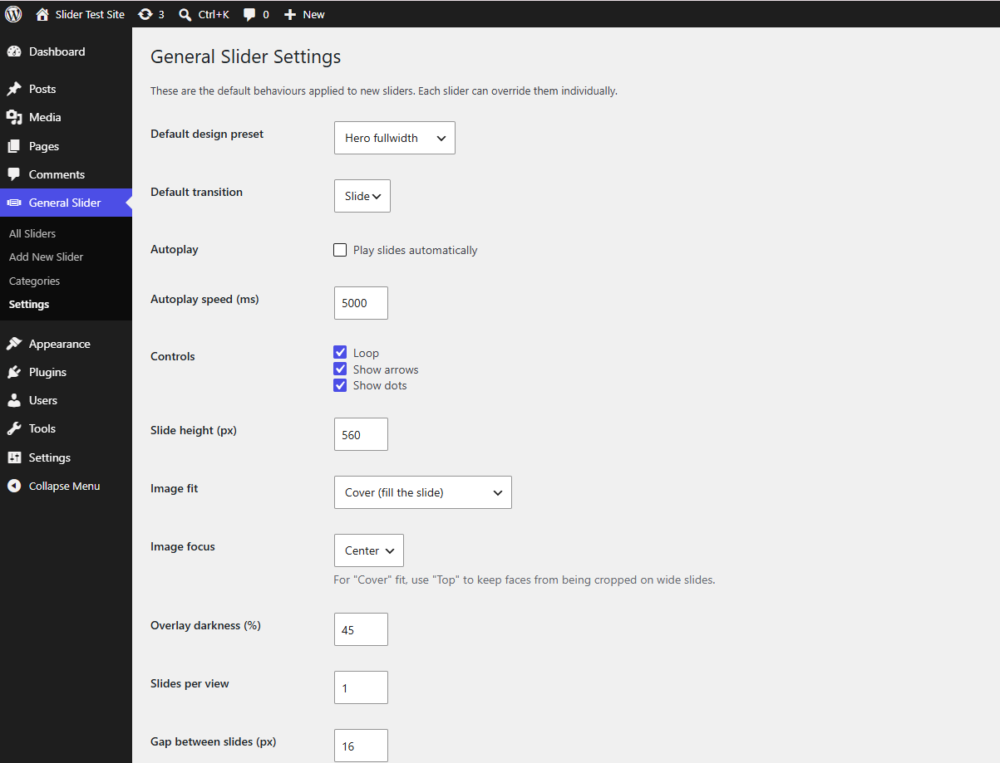
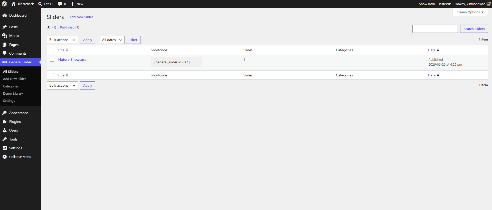

# General Slider

> A lightweight, easy-to-use carousel slider for WordPress. Build reusable sliders and drop them anywhere with a block — no coding required.

[](https://wordpress.org/plugins/general-slider/)
[](https://wordpress.org/plugins/general-slider/)
[](LICENSE)


Built on the lightweight [Splide](https://splidejs.com/) engine — **no jQuery** on the front end, accessible by default, and assets only load on pages that actually show a slider.

## Features

- Reusable sliders — build once, use anywhere
- Gutenberg block, shortcode and **Elementor** widget
- Five design presets — Hero, Split, Minimal, Testimonial, Fullscreen
- Per-slide image **or background video** (self-hosted MP4/WebM, YouTube or Vimeo)
- Multiple slides per view (carousel), thumbnail navigation, Ken Burns zoom and text animations
- Per-slider settings: autoplay (+ pause button), loop, arrows, dots, slide/fade, height, overlay (solid or gradient), image fit/focus and accent colour
- Custom CSS, categories, duplicate and JSON import / export
- **Demo Library** — one-click ready-made sliders (a starter demo ships with the plugin)
- Responsive, **accessible** (keyboard + screen reader, pause control), respects reduced-motion
- Performance friendly: lazy-loaded images, viewport lazy-init, RTL ready

## Installation

**From WordPress.org (recommended)**

Search for *General Slider* in **Plugins → Add New**, or [download it](https://wordpress.org/plugins/general-slider/).

**Manual**

1. Download this repository as a ZIP.
2. Upload it via **Plugins → Add New → Upload Plugin**.
3. Activate, then go to **General Slider → Add New**.

## Usage

Create a slider under **General Slider → Add New**, add slides, then embed it:

- **Block:** add the *General Slider* block and pick your slider.
- **Shortcode:** `[general_slider id="123"]`
- **Elementor:** drop the *General Slider* widget.

## Demo Library

A starter demo ships inside the plugin and is created automatically on first activation, so a fresh install isn't empty. **General Slider → Demo Library** offers more ready-made sliders — imported in one click, images and all — from an online library ([wp-plugin-demo-library](https://github.com/devmonowar/wp-plugin-demo-library)) served over GitHub Pages, so new demos appear **without updating the plugin**.

Developers can package any slider into a portable demo with the **Export Slider** row action, then re-import a package from the Demo Library screen.

## Developer filters

```php
// Change a slider's resolved settings.
add_filter( 'general_slider_settings', function ( $settings, $post_id ) { return $settings; }, 10, 2 );

// Modify the slides before rendering.
add_filter( 'general_slider_slides', function ( $slides, $post_id ) { return $slides; }, 10, 2 );

// Change the Splide JS options.
add_filter( 'general_slider_config', function ( $config, $post_id ) { return $config; }, 10, 2 );

// Filter the final markup.
add_filter( 'general_slider_html', function ( $html, $post_id, $settings ) { return $html; }, 10, 3 );

// Register your own design preset (also provide a `.gs-preset-{key}` stylesheet).
add_filter( 'general_slider_presets', function ( $presets ) { return $presets; } );

// Point the Demo Library at a different manifest (dev / staging).
add_filter( 'general_slider_demo_library_url', function ( $url ) { return $url; } );
```

## Screenshots

| Front end | Settings | Editor |
| --- | --- | --- |
|  |  |  |

## Development

This is the development repository. The released plugin lives on [WordPress.org](https://wordpress.org/plugins/general-slider/). Front-end assets ship un-minified; the only bundled third-party library is Splide (`assets/vendor/splide`, MIT).

## License

[GPLv2 or later](LICENSE).
